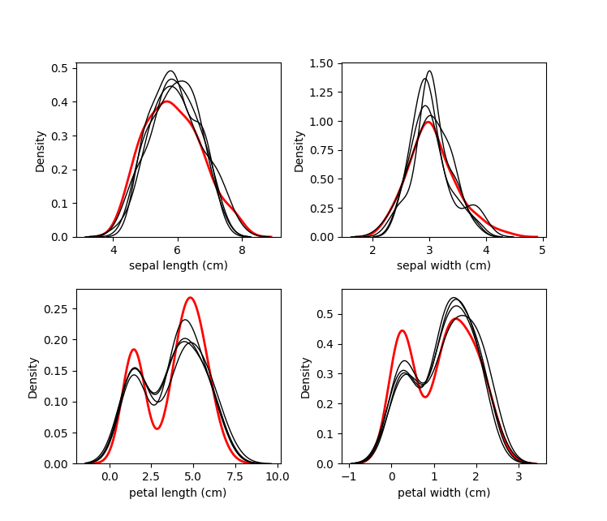
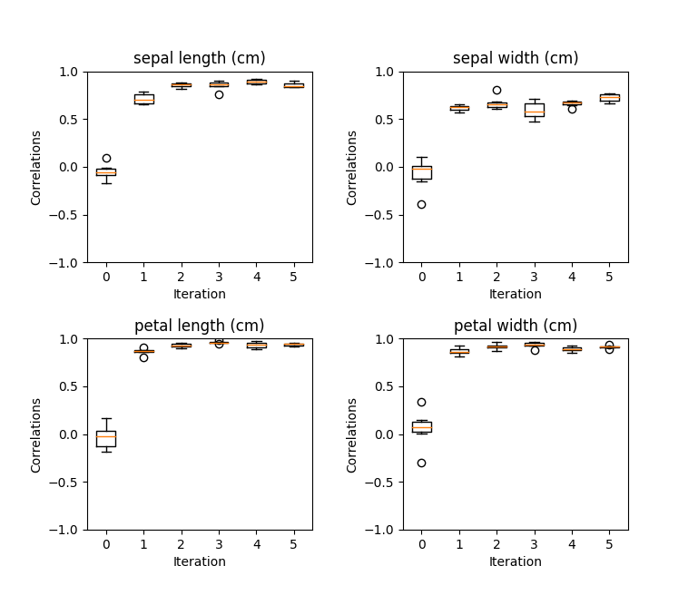
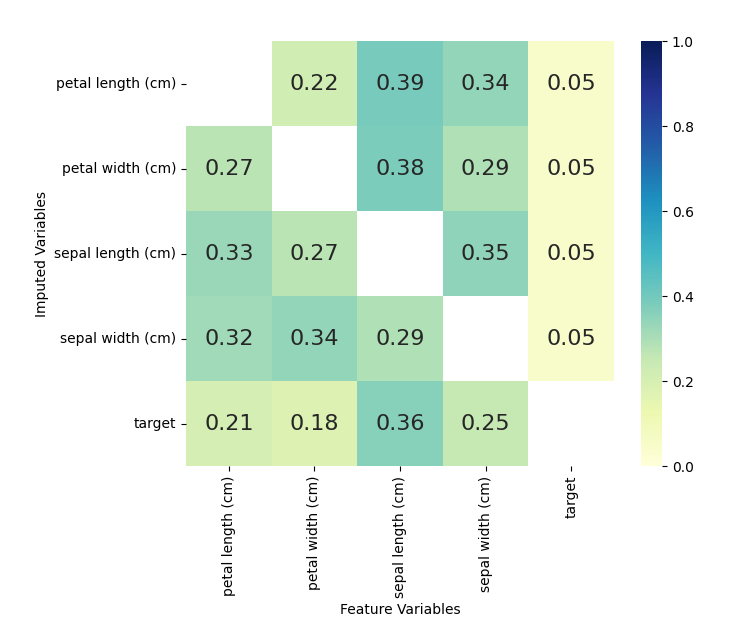
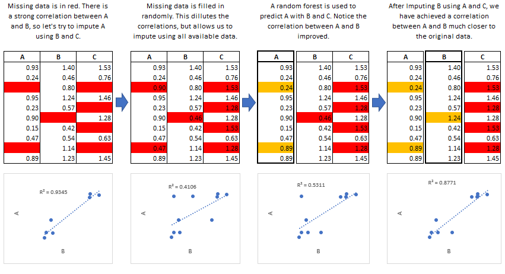
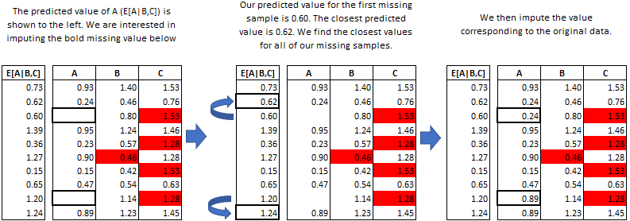
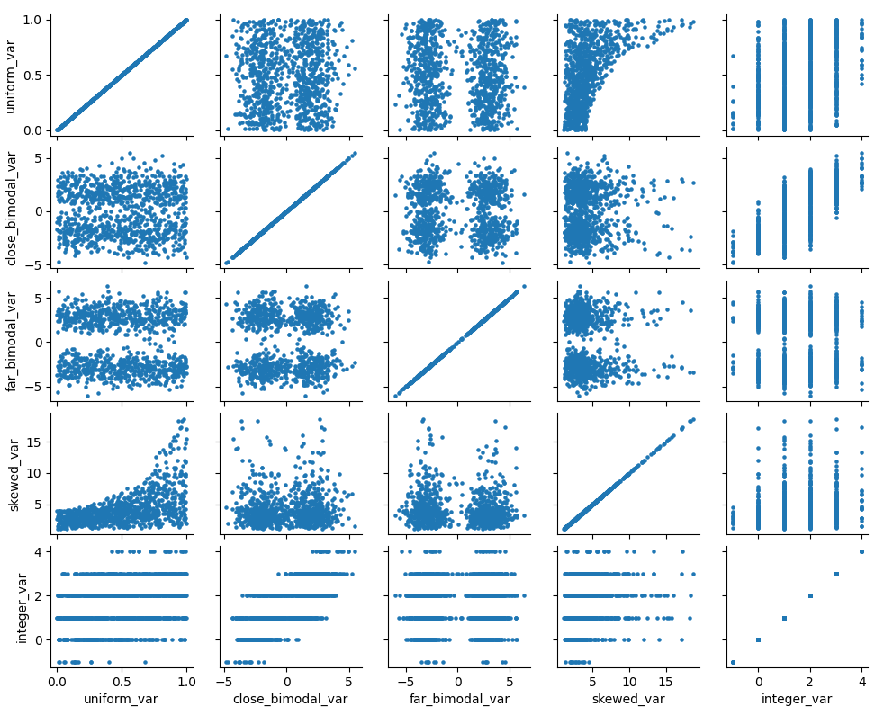
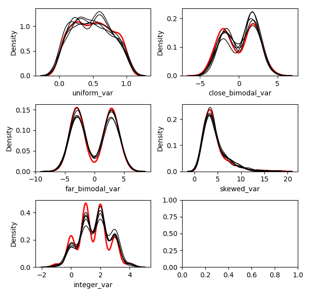
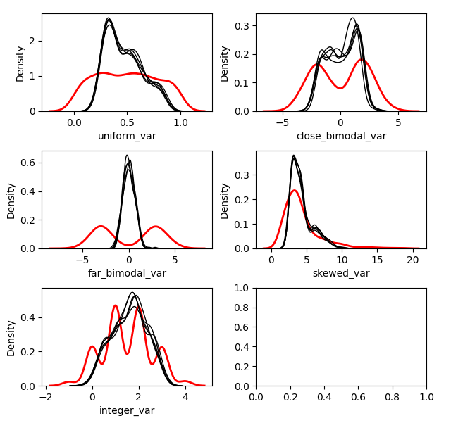

<center>

[](https://travis-ci.org/AnotherSamWilson/miceforest)
[](https://pypi.org/project/miceforest/)
[](http://opensource.org/licenses/MIT)
[](https://codecov.io/gh/AnotherSamWilson/miceforest)
[](https://github.com/psf/black)  
[](https://pypi.org/project/miceforest/)
[](https://pypi.python.org/pypi/miceforest)
[](https://pepy.tech/project/miceforest/week)

</center>

## miceforest: Fast Imputation with Random Forests in Python

<a href='https://github.com/AnotherSamWilson/miceforest'></a>

Fast, memory efficient Multiple Imputation by Chained Equations (MICE)
with random forests. It can impute categorical and numeric data without
much setup, and has an array of diagnostic plots available. The R
version of this package maybe found
[here](https://github.com/FarrellDay/miceRanger).

This document contains a thorough walkthrough of the package,
benchmarks, and an introduction to multiple imputation. More information
on MICE can be found in Stef van Buuren’s excellent online book, which
you can find
[here](https://stefvanbuuren.name/fimd/ch-introduction.html).

#### Table of Contents:

  - [Using
    miceforest](https://github.com/AnotherSamWilson/miceforest#Using-miceforest)
      - [Simple
        Example](https://github.com/AnotherSamWilson/miceforest#Simple-Example)
      - [Controlling Tree
        Growth](https://github.com/AnotherSamWilson/miceforest#Controlling-Tree-Growth)
      - [Custom Imputation
        Schemas](https://github.com/AnotherSamWilson/miceforest#Creating-a-Custom-Imputation-Schema)
      - [Imputing New Data with Existing
        Models](https://github.com/AnotherSamWilson/miceforest#Imputing-New-Data-with-Existing-Models)
  - [Diagnostic
    Plotting](https://github.com/AnotherSamWilson/miceforest#Diagnostic-Plotting)
      - [Imputed
        Distributions](https://github.com/AnotherSamWilson/miceforest#Distribution-of-Imputed-Values)
      - [Correlation
        Convergence](https://github.com/AnotherSamWilson/miceforest#Convergence-of-Correlation)
      - [Variable
        Importance](https://github.com/AnotherSamWilson/miceforest#Variable-Importance)
  - [Using the Imputed
    Data](https://github.com/AnotherSamWilson/miceforest#Using-the-Imputed-Data)
  - [The MICE
    Algorithm](https://github.com/AnotherSamWilson/miceforest#The-MICE-Algorithm)
      - [Introduction](https://github.com/AnotherSamWilson/miceforest#The-MICE-Algorithm)
      - [Common Use
        Cases](https://github.com/AnotherSamWilson/miceforest#Common-Use-Cases)
      - [Predictive Mean
        Matching](https://github.com/AnotherSamWilson/miceforest#Predictive-Mean-Matching)
      - [Effects of Mean
        Matching](https://github.com/AnotherSamWilson/miceforest#Effects-of-Mean-Matching)
  - [Installation](https://github.com/AnotherSamWilson/miceforest#Installation)

## Using miceforest

In these examples we will be looking at a simple example of multiple
imputation. We need to load the packages, and define the data:

``` python
import miceforest as mf
from sklearn.datasets import load_iris
import pandas as pd
import numpy as np

# Load data and introduce missing values
iris = pd.concat(load_iris(as_frame=True,return_X_y=True),axis=1)
iris['target'] = iris['target'].astype('category')
iris_amp = mf.ampute_data(iris,perc=0.25,random_state=1991)
```

### Simple example

Now that we have our data with missing values, we can impute them with
miceforest

``` python
# Create kernel. 
kernel = mf.MultipleImputedKernel(
  iris_amp,
  datasets=4,
  save_all_iterations=True,
  random_state=1991
)

# Run the MICE algorithm for 4 iterations on the kernel
kernel.mice(4)

# Return and print the completed kernel data
completed_data = kernel.complete_data()
print(completed_data.isna().sum())
```

    ## sepal length (cm)    0
    ## sepal width (cm)     0
    ## petal length (cm)    0
    ## petal width (cm)     0
    ## target               0
    ## dtype: int64

Printing the `MultipleImputedKernel` object will tell you some high
level information:

``` python
print(kernel)
```

    ##               Class: MultipleImputedKernel
    ##        Models Saved: True
    ##            Datasets: 4
    ##          Iterations: 4
    ##   Imputed Variables: 5
    ## save_all_iterations: True

### Controlling Tree Growth

A *very* nice thing about random forests is that they are trivially
parallelizable. We can save a lot of time by setting the `n_jobs`
parameter in both the fit and predict methods for the random forests:

``` python
# Run the MICE algorithm for 2 more iterations on the kernel, 
kernel.mice(2,save_models=True,n_jobs=2)
```

Any other arguments may be passed to either class
(`RandomForestClassifier`,`RandomForestRegressor`).

### Creating a Custom Imputation Schema

It is possible to customize our imputation procedure by variable. By
passing a named list to `variable_schema`, you can specify the
predictors for each variable to impute. You can also select which
variables should be imputed using mean matching, as well as the mean
matching candidates, by passing a dict to`mean_match_candidates`:

``` python
var_sch = {
    'sepal width (cm)': ['target','petal width (cm)'],
    'petal width (cm)': ['target','sepal length (cm)']
}
var_mmc = {
    'sepal width (cm)': 5,
    'petal width (cm)': 0
}

cust_kernel = mf.MultipleImputedKernel(
    iris_amp,
    datasets=3,
    variable_schema=var_sch,
    mean_match_candidates=var_mmc
)
cust_kernel.mice(2,save_models=True)
```

### Imputing New Data with Existing Models

Multiple Imputation can take a long time. If you wish to impute a
dataset using the MICE algorithm, but don’t have time to train new
models, it is possible to impute new datasets using a
`MultipleImputedKernel` object. The `impute_new_data()` function uses
the random forests collected by `MultipleImputedKernel` to perform
multiple imputation without updating the random forest at each
iteration:

``` python
# Our 'new data' is just the first 15 rows of iris_amp
new_data = iris_amp.iloc[range(15)]
new_data_imputed = kernel.impute_new_data(new_data=new_data)
print(new_data_imputed)
```

    ##               Class: ImputedDataSet
    ##            Datasets: 4
    ##          Iterations: 6
    ##   Imputed Variables: 5
    ## save_all_iterations: False

All of the imputation parameters (variable\_schema,
mean\_match\_candidates, etc) will be carried over from the original
`MultipleImputedKernel` object. When mean matching, the candidate values
are pulled from the original kernel dataset.

## Diagnostic Plotting

As of now, miceforest has three diagnostic plots available.

### Distribution of Imputed-Values

We probably want to know how the imputed values are distributed. We can
plot the original distribution beside the imputed distributions in each
dataset by using the `plot_imputed_distributions` method of an
`ImputedDataSet` object:

``` python
kernel.plot_imputed_distributions(wspace=0.3,hspace=0.3)
```



The red line is the original data, and each black line are the imputed
values of each dataset.

### Convergence of Correlation

We are probably interested in knowing how our values between datasets
converged over the iterations. The `plot_correlations` method shows you
a boxplot of the correlations between imputed values in every
combination of datasets, at each iteration. This allows you to see how
correlated the imputations are between datasets, as well as the
convergence over iterations:

``` python
kernel.plot_correlations()
```



### Variable Importance

We also may be interested in which variables were used to impute each
variable. We can plot this information by using the
`plot_feature_importance` method.

``` python
plot_feature_importance(annot=True,cmap="YlGnBu",vmin=0, vmax=1)
```



The numbers shown are returned from the sklearn random forest
`_feature_importance` attribute. Each square represents the importance
of the column variable in imputing the row variable.

## Using the Imputed Data

To return the imputed data simply use the `complete_data` method:

``` python
dataset_1 = kernel.complete_data(0)
```

This will return a single specified dataset. Multiple datasets are
typically created so that some measure of confidence around each
prediction can be created.

Since we know what the original data looked like, we can cheat and see
how well the imputations compare to the original data:

``` python
acclist = []
for iteration in range(kernel.get_iterations()+1):
    target_na_count = kernel.na_counts['target']
    compdat = kernel.complete_data(iteration=iteration)
    
    # Record the accuract of the imputations of target.
    acclist.append(
      round(1-sum(compdat['target'] != iris['target'])/target_na_count,2)
    )

# acclist shows the accuracy of the imputations
# over the iterations.
print(acclist)
```

    ## [0.32, 0.51, 0.57, 0.65, 0.68, 0.73, 0.81]

In this instance, we went from a \~32% accuracy (which is expected with
random sampling) to an accuracy of \~81%. We managed to replace the
missing `target` values with a pretty high degree of accuracy\! We could
probably get better accuracy if we ran more iterations.

## The MICE Algorithm

Multiple Imputation by Chained Equations ‘fills in’ (imputes) missing
data in a dataset through an iterative series of predictive models. In
each iteration, each specified variable in the dataset is imputed using
the other variables in the dataset. These iterations should be run until
it appears that convergence has been met.



This process is continued until all specified variables have been
imputed. Additional iterations can be run if it appears that the average
imputed values have not converged, although no more than 5 iterations
are usually necessary.

### Common Use Cases

##### **Data Leakage:**

MICE is particularly useful if missing values are associated with the
target variable in a way that introduces leakage. For instance, let’s
say you wanted to model customer retention at the time of sign up. A
certain variable is collected at sign up or 1 month after sign up. The
absence of that variable is a data leak, since it tells you that the
customer did not retain for 1 month.

##### **Funnel Analysis:**

Information is often collected at different stages of a ‘funnel’. MICE
can be used to make educated guesses about the characteristics of
entities at different points in a funnel.

##### **Confidence Intervals:**

MICE can be used to impute missing values, however it is important to
keep in mind that these imputed values are a prediction. Creating
multiple datasets with different imputed values allows you to do two
types of inference:

  - Imputed Value Distribution: A profile can be built for each imputed
    value, allowing you to make statements about the likely distribution
    of that value.  
  - Model Prediction Distribution: With multiple datasets, you can build
    multiple models and create a distribution of predictions for each
    sample. Those samples with imputed values which were not able to be
    imputed with much confidence would have a larger variance in their
    predictions.

### Predictive Mean Matching

`miceforest` can make use of a procedure called predictive mean matching
(PMM) to select which values are imputed. PMM involves selecting a
datapoint from the original, nonmissing data which has a predicted value
close to the predicted value of the missing sample. The closest N
(`mean_match_candidates` parameter) values are chosen as candidates,
from which a value is chosen at random. This can be specified on a
column-by-column basis. Going into more detail from our example above,
we see how this works in practice:



This method is very useful if you have a variable which needs imputing
which has any of the following characteristics:

  - Multimodal  
  - Integer  
  - Skewed

### Effects of Mean Matching

As an example, let’s construct a dataset with some of the above
characteristics:

``` python
randst = np.random.RandomState(1991)
# random uniform variable
nrws = 1000
uniform_vec = randst.uniform(size=nrws)

def make_bimodal(mean1,mean2,size):
    bimodal_1 = randst.normal(size=nrws, loc=mean1)
    bimodal_2 = randst.normal(size=nrws, loc=mean2)
    bimdvec = []
    for i in range(size):
        bimdvec.append(randst.choice([bimodal_1[i], bimodal_2[i]]))
    return np.array(bimdvec)

# Make 2 Bimodal Variables
close_bimodal_vec = make_bimodal(2,-2,nrws)
far_bimodal_vec = make_bimodal(3,-3,nrws)


# Highly skewed variable correlated with Uniform_Variable
skewed_vec = np.exp(uniform_vec*randst.uniform(size=nrws)*3) + randst.uniform(size=nrws)*3

# Integer variable correlated with Close_Bimodal_Variable and Uniform_Variable
integer_vec = np.round(uniform_vec + close_bimodal_vec/3 + randst.uniform(size=nrws)*2)

# Make a DataFrame
dat = pd.DataFrame(
    {
    'uniform_var':uniform_vec,
    'close_bimodal_var':close_bimodal_vec,
    'far_bimodal_var':far_bimodal_vec,
    'skewed_var':skewed_vec,
    'integer_var':integer_vec
    }
)

# Ampute the data.
ampdat = mf.ampute_data(dat,perc=0.25,random_state=randst)

# Plot the original data
import seaborn as sns
import matplotlib.pyplot as plt
g = sns.PairGrid(dat)
g.map(plt.scatter,s=5)
```


We can see how our variables are distributed and correlated in the graph
above. Now let’s run our imputation process twice, once using mean
matching, and once using the model prediction.

``` r
kernelmeanmatch <- mf.MultipleImputedKernel(ampdat,mean_match_candidates=5)
kernelmodeloutput <- mf.MultipleImputedKernel(ampdat,mean_match_candidates=0)

kernelmeanmatch.mice(5)
kernelmodeloutput.mice(5)
```

Let’s look at the effect on the different variables.

##### With Mean Matching

``` python
kernelmeanmatch.plot_imputed_distributions(wspace=0.2,hspace=0.4)
```



##### Without Mean Matching

``` python
kernelmodeloutput.plot_imputed_distributions(wspace=0.2,hspace=0.4)
```



You can see the effects that mean matching has, depending on the
distribution of the data. Simply returning the value from the model
prediction, while it may provide a better ‘fit’, will not provide
imputations with a similair distribution to the original. This may be
beneficial, depending on your goal.

## Installation

You can download the latest stable version from PyPi:

``` bash
$ pip install miceforest
```

You can also download the latest development version from this
repository:

``` bash
$ pip install git+https://github.com/AnotherSamWilson/miceforest.git
```
